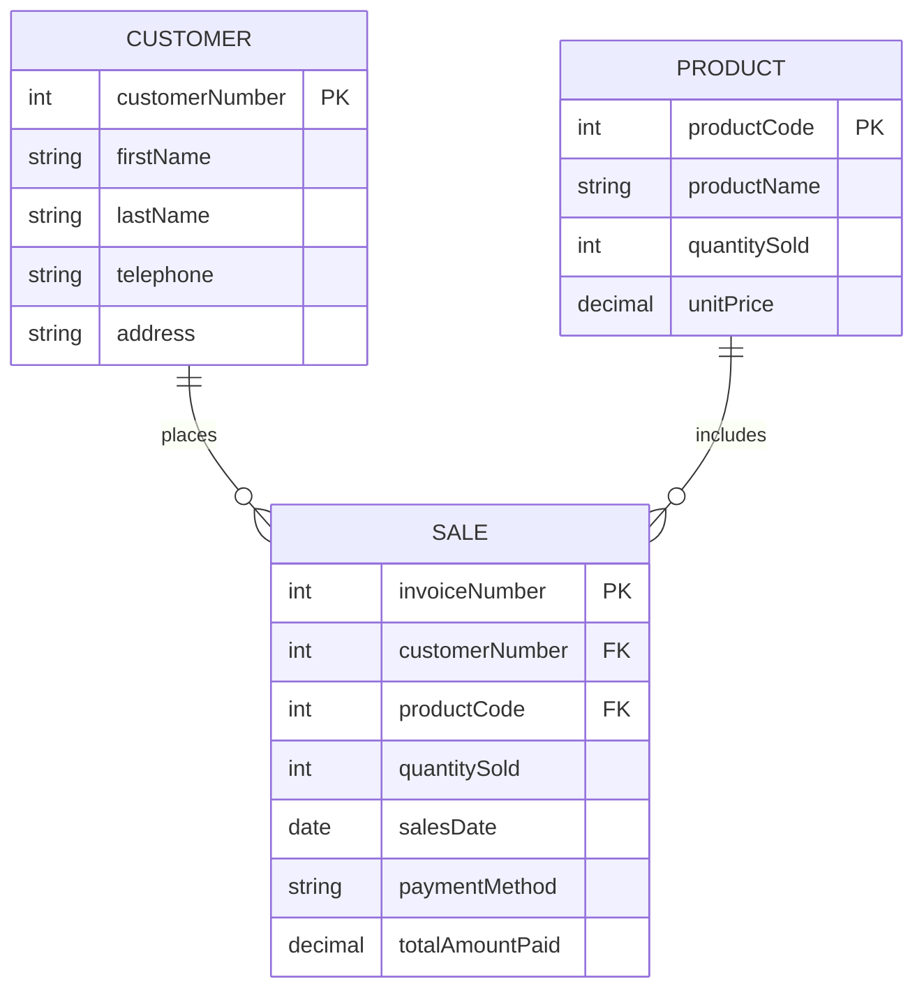

# SalesPro SRMS - Professional Project Design

## 1) ERD Design (Entities, Keys, Cardinality)

- `CUSTOMER (1) -> (M) SALE` using `sales.customerNumber` as FK.
- `PRODUCT (1) -> (M) SALE` using `sales.productCode` as FK.
- Primary keys:
  - `customers.customerNumber`
  - `products.productCode`
  - `sales.invoiceNumber`
- Foreign keys:
  - `sales.customerNumber -> customers.customerNumber`
  - `sales.productCode -> products.productCode`

## 2) Backend Design (`backend-project`)

- Stack: Node.js, Express.js, MySQL, JWT authentication.
- APIs:
  - `POST /api/auth/login`
  - `POST/GET /api/customers` (insert + list)
  - `POST/GET/PUT/DELETE /api/sales` (full sales CRUD as required)
  - `POST/GET /api/products` (insert + list)
  - `GET /api/reports?range=daily|weekly|monthly`
- Database script:
  - `backend-project/sql/srms_schema.sql`
- Default login account:
  - username: `admin`
  - password: `admin123`

## 3) Frontend Design (`frontend-project`)

- Stack: React + Vite + Tailwind CSS + Axios + React Router.
- Pages from menu bar:
  - `Customer`
  - `Product`
  - `Sales`
  - `Reports`
  - `Logout`
- UI/UX:
  - Responsive layout with clean cards and tables.
  - Protected routes with JWT token storage.
  - Sales page supports retrieve/update/delete.
  - Reports page supports daily, weekly, monthly summaries.

## 4) Run Instructions

1. Create MySQL database/tables:
  - execute `backend-project/sql/srms_schema.sql`
2. Configure backend:
  - copy `backend-project/.env.example` to `.env`
  - set your MySQL credentials and JWT secret
3. Start backend:
  - `cd backend-project`
  - `npm run dev`
4. Start frontend:
  - `cd frontend-project`
  - `npm run dev`

## 5) Practical Exam Folder Naming

For submission, place this work inside:

`FirstName_LastName_National_Practical_Exam_2026`